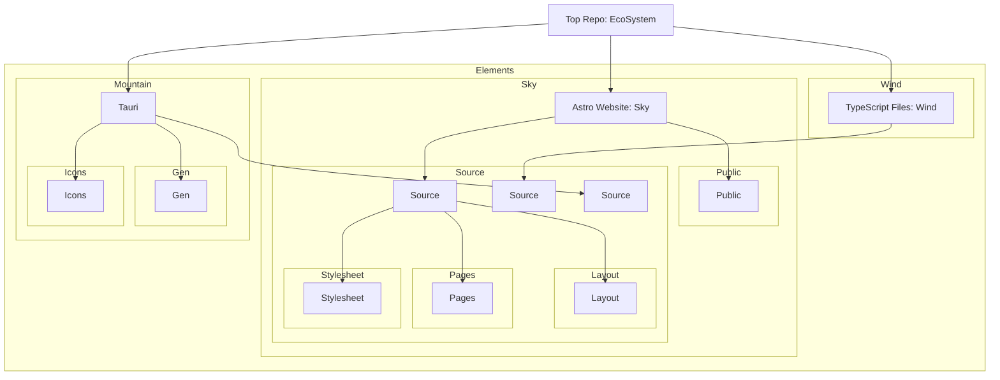
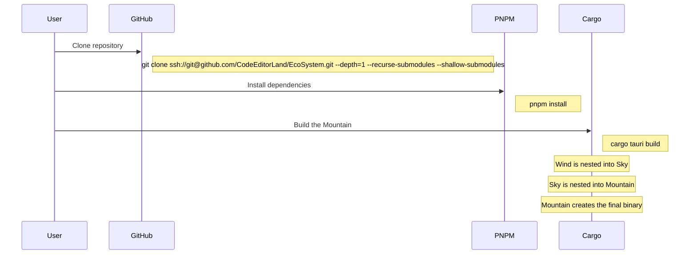

# 🌿 [EcoSystem] —

## Installation

Clone the repository:

```sh
git clone ssh://git@github.com/CodeEditorLand/EcoSystem.git --depth=1 --recurse-submodules --shallow-submodules
```

Install the necessary dependencies using `pnpm`:

```sh
pnpm install
```

Build the `EcoSystem`:

```sh
# Build TypeScript and workspace packages
pnpm run prepublishOnly

# Build Debug releases for cargo
cargo build

# Build Production releases for cargo
cargo build --release

# Build the Tauri application
pnpm run tauri build
```

Run the `EcoSystem`:

```sh
# Runs the development version of the application
pnpm run tauri dev
```

## Usage

First run the [`Sun`](./Target/release/Sun.exe) binary then the
[`River`](./Target/release/River.exe) to startup the necessary websockets. Then
run the Tauri app [`Mountain`](./Target/release/Mountain.exe)


## Graph





[EcoSystem]: https://github.com/CodeEditorLand/EcoSystem

## Changelog

See [CHANGELOG.md](CHANGELOG.md) for a history of changes to this ecosystem.
